# 一、苍穹外卖，二次开发笔记


## 1. 前端环境部署

下载Front-end operating environment文件夹，前端项目部署在nginx上，nginx已经配置好了，只需点击exe程序就可以将nginx启动，然后在浏览器中访问localhost就可以看到前端页面。

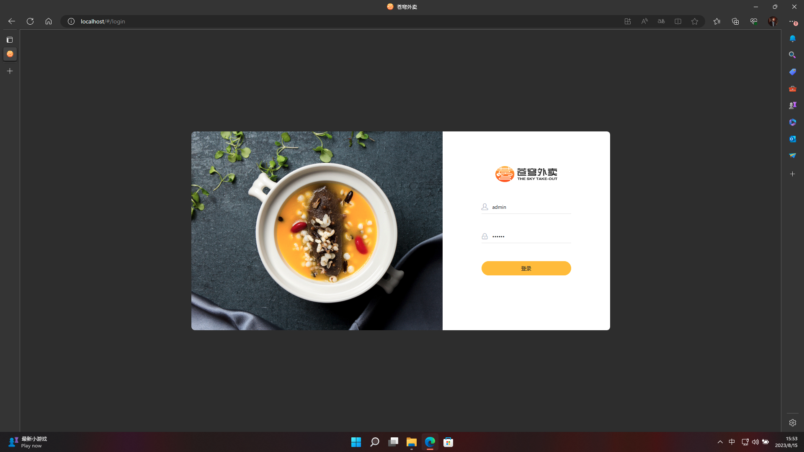

## 2. 后端环境开发

sky-take-out文件夹是后端初始项目文件夹，并且进行了分模块开发。

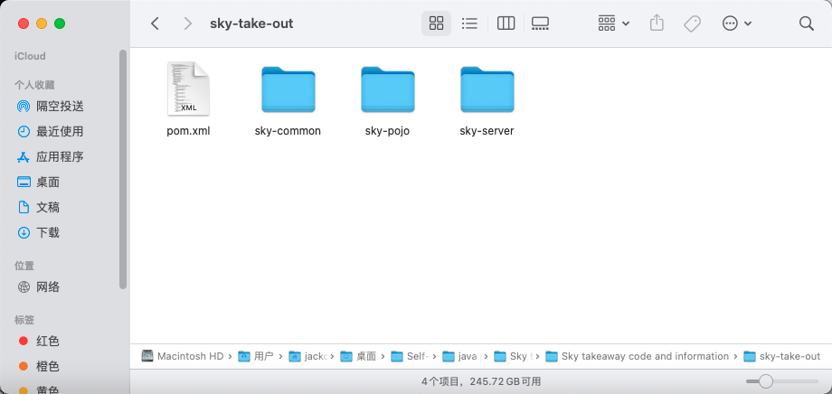

- Sky-common：子模块，存放公共类，例如工具类、常量类、异常类
- Sky-pojo：子模块，存放实体类、VO、DTO等
- Sky-server：子模块，后端服务，存放配置文件、Controller、Service和mapper等
- Sky-take-out：maven父工程，统一管理依赖版本，聚合其他子模块

## 3. git环境搭建

- 创建本地仓库

```shell
#在项目文件夹下打开终端输入下面的命令
git init
#将代码添加到暂存区
git add *
#将代码提交到本地仓库
git git commit -m "first commit" *
```

- 创建远程仓库

> github上创建远程仓库

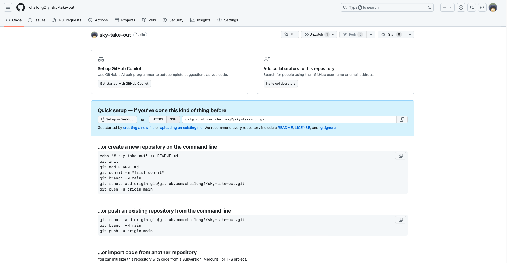

- 将代码推送到远程仓库中

```shell
git remote add ori git@github.com:chailong2/sky-take-out.git #也可以直接使用链接
#这个地址是我的远程仓库的https地址 
git remote -v
#将本地仓库的内容推动到远程仓库
git push ori master
```

## 4. 数据库环境搭建

database中的文件夹中的sql文件在navicat中直接运行即可

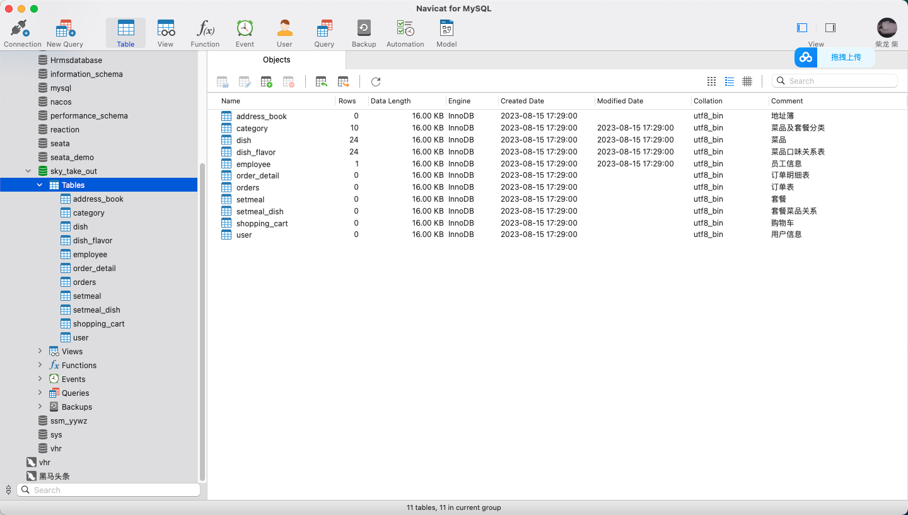

## 5. 测试前后端通信

这里前后通信的关键是nginx.conf文件中配置的反向代理操作，这里nginx配置文件已经提前配置好了，直接运行项目（注意数据库密码修改成自己的密码，然后在登陆页面直接登陆，就可以进入主控制台）

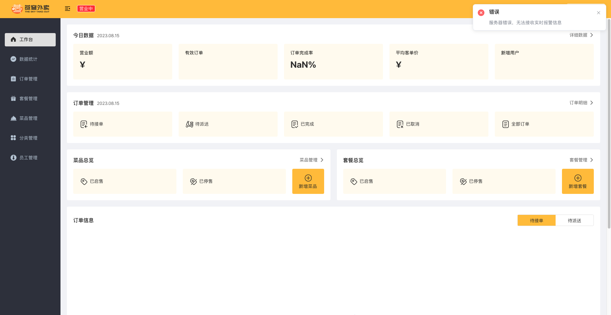

## 6. 对用户的密码进行加密后进行存储（提高安全性）

这里使用MD5加密方式对明文密码进行加密

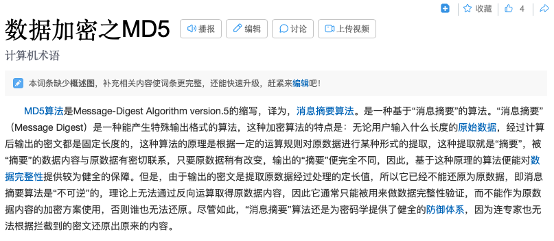

**完善登陆功能**

```java
 //密码比对
 // 对前端传递过来的明文密码进行MD5加密
 password= DigestUtils.md5DigestAsHex(password.getBytes());
```

注意数据库中明文密码也要改为，加密后的MD5

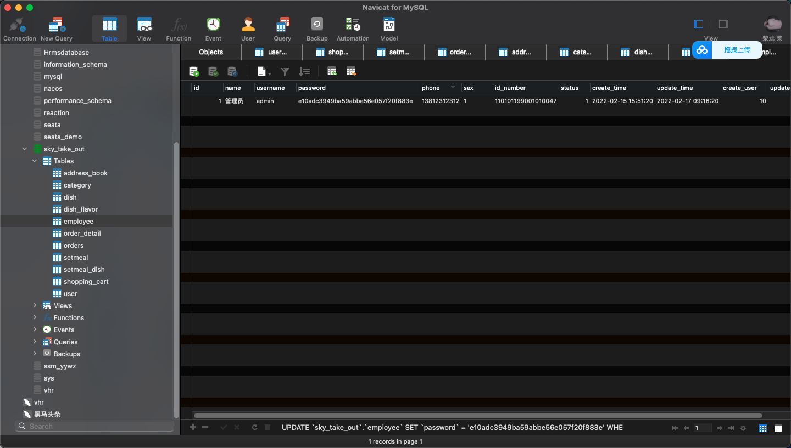

## 7. 导入接口文档

- 前后端分离开发流程

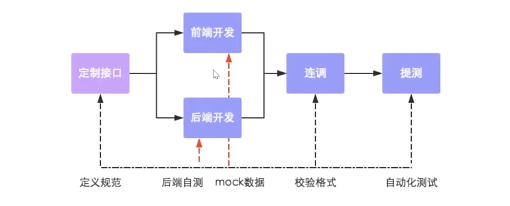

- 操作

将资料接口文档中的两个Json文件导入到APIFOX中，网页版可以直接使用

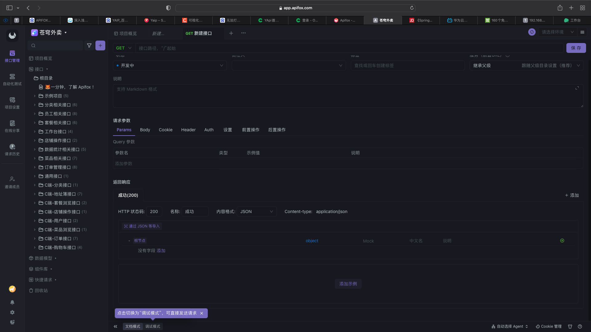

## 8. Swagger使用

Knife4j是为java MVC框架集成Swagger生存Api文档的增强解决方案，其使用方式如下：

- 导入knife4j的maven坐标

```xml
<dependency>
            <groupId>com.github.xiaoymin</groupId>
            <artifactId>knife4j-spring-boot-starter</artifactId>
        </dependency>
```

- 在配置类中加入knife4j相关配置

```java
 @Bean
    public Docket docket() {
        ApiInfo apiInfo = new ApiInfoBuilder()
                .title("苍穹外卖项目接口文档")
                .version("2.0")
                .description("苍穹外卖项目接口文档")
                .build();
        Docket docket = new Docket(DocumentationType.SWAGGER_2)
                .apiInfo(apiInfo)
                .select()
                .apis(RequestHandlerSelectors.basePackage("com.sky.controller"))
                .paths(PathSelectors.any())
                .build();
        return docket;
    }
```

- 设计静态资源映射，否则接口文档页面无法访问

```java
 protected void addResourceHandlers(ResourceHandlerRegistry registry) {
        registry.addResourceHandler("/doc.html").addResourceLocations("classpath:/META-INF/resources/");
        registry.addResourceHandler("/webjars/**").addResourceLocations("classpath:/META-INF/resources/webjars/");
    }
```

- 自动生成接口文档

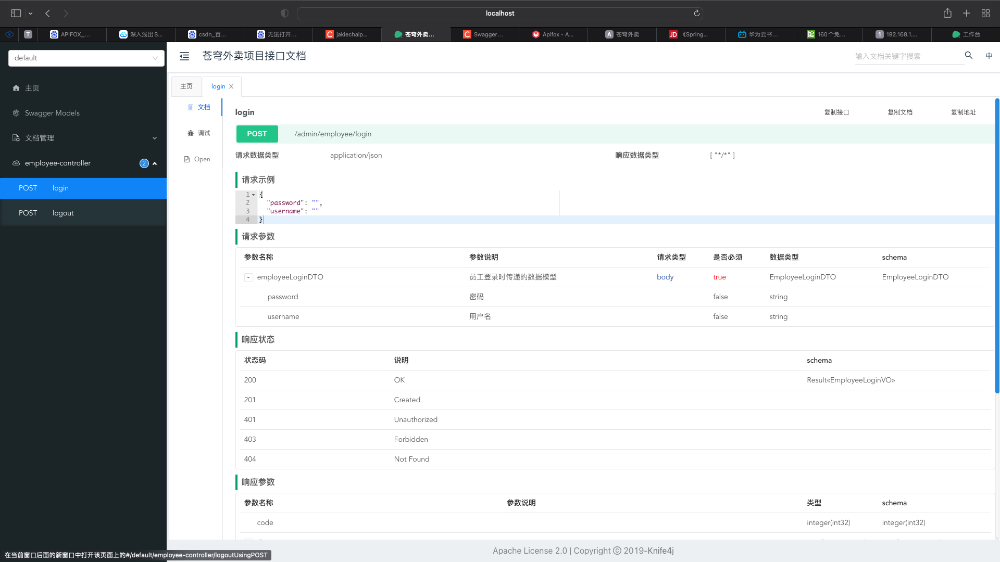

## 9. pageHelper实现分页查询

PageHelper是MyBatis的一个插件，内部实现了一个PageInterceptor[拦截器](https://so.csdn.net/so/search?q=拦截器&spm=1001.2101.3001.7020)。Mybatis会加载这个拦截器到拦截器链中。在我们使用过程中先使用PageHelper.startPage这样的语句在当前线程上下文中设置一个ThreadLocal变量，再利用PageInterceptor这个分页拦截器拦截，从ThreadLocal中拿到分页的信息，如果有分页信息拼装分页SQL（limit语句等）进行分页查询，最后再把ThreadLocal中的东西清除掉。pageHelper使用了ThreadLocal保存分页参数，分页参数和线程是绑定的。因此**我们需要保证PageHelper 的startPage调用后紧跟 MyBatis 查询方法，这就是安全的**。因为 PageHelper 在 finally 代码段中自动清除了 ThreadLocal 存储的对象。如果代码在进入Executor前发生异常，就会导致线程不可用，这属于人为Bug（例如接口方法和XML中的不匹配，导致找不到MapppedStatement时）。这种情况由于线程不可用，也不会导致 ThreadLocal参数被错误使用。但是如果写出以下代码，就是不安全的用法：

```java
PageHelper.startPage(1, 10);
List<Country> list;
if(param1 != null){
    list = countryMapper.selectIf(param1);
} else {
    list = new ArrayList<Country>();
}

```

这种情况下由于param1存在null的情况，就会导致PageHelper产生了一个分页参数，但是没有被消费，也没有被清理。这个参数就会一直保存在ThreadLocal中。可能导致其它不该分页的方法去消费了这个参数，莫名其妙的做了分页。此外如果考虑到发生异常，可以加一个finally块，手动清理参数。

## 10. 解决日期格式不规范问题

如下图这是我们现在页面展示出来的日期信息：

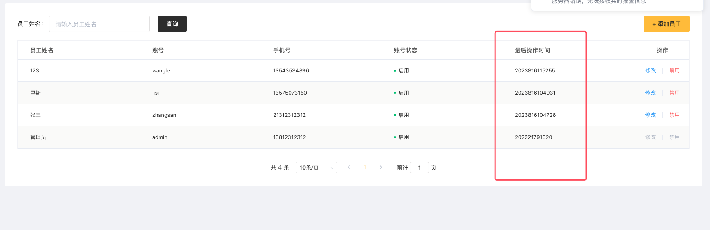

我们有两种方法解决上面问题：

- 在日期属性加入注解，对日期进行格式话（缺点是每个日期属性可能都需要加注解，没有实现统一管理）

```java
@JsonFormat(pattern="yyyy-MM-dd HH:mm:ss")
```

- 在WebMvcConfiguration中扩展Spring MVC消息转换器，统一对日期格式进行格式化处理

```java
   @Override
    protected void extendMessageConverters(List<HttpMessageConverter<?>> converters) {
        log.info("扩展消息转换器....");
        //创建一个消息转换器对象
        MappingJackson2HttpMessageConverter converter = new MappingJackson2HttpMessageConverter();
        //需要为消息转换器设置一个对象转换器，对象转换器可以将Java对象序列化为Json字符串
        converter.setObjectMapper(new JacksonObjectMapper());
        //将自己的消息转换器放到容器中
        converters.add(0,converter);
    }
```

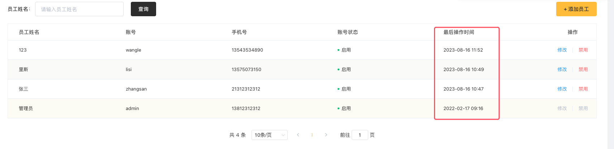

## 11. 解决公共字段自动填充问题

- 自定义注解AutoFill，用于标识需要进行公共字段自动填充的方法

```java
@Target(ElementType.METHOD)
@Retention(RetentionPolicy.RUNTIME)
public @interface AutoFill {
    //数据库操作类型
    OperationType value();
}
```

- 自定义切面类AutoFillAspect，统一拦截加入类AutoFill注解的方法，通过反射为公共子段赋值

```java
@Aspect
@Component
@Slf4j
public class AutoFillAspect {
    /**
     * 切入点
     */
    //切点表达式
    @Pointcut("execution(* com.sky.mapper.*.*(..)) && @annotation(com.sky.annotation.AutoFill)")
    public void autoFillPointCut(){

    }

    /**
     * 前置通知，在通知中给公共子段赋值
     */
    @Before("autoFillPointCut()")
    public void autoFill(JoinPoint joinPoint){
        log.info("开始进行公共子段填充");
        //1.获取到当前被拦截的方法上的数据库操作类型
        /**
         *这段代码是用于获取连接点的签名信息。具体而言，它使用joinPoint.getSignature()方法来获取连接点的签名对象，并将其赋值给名为"signature"的变量。
         *通过这个签名对象，我们可以获取连接点的一些关键信息，如方法名、声明类型、参数等。这个代码片段通常用于在切面中获取连接点的详细信息，以便进行后续的处理或记录。
         */
        MethodSignature signature = (MethodSignature) joinPoint.getSignature();
        AutoFill autoFill=signature.getMethod().getAnnotation(AutoFill.class);
        OperationType value = autoFill.value();
        //2.获取到当前被拦截方法的参数—实体对象
        Object[] args = joinPoint.getArgs();
        if (args==null || args.length==0) {
            return;
        }
        Object arg = args[0];
        //3.准备赋值的数据
        LocalDateTime now = LocalDateTime.now();
        Long currentid= BaseContext.getCurrentId();
        //4.根据当前不同的操作类型，为对应的属性通过反射来赋值
        if(value==OperationType.INSERT){
            //为四个公共子段赋值
            try {
                Method setCreateTimes = arg.getClass().getDeclaredMethod(AutoFillConstant.SET_CREATE_TIME, LocalDateTime.class);
                Method setCreateUser = arg.getClass().getDeclaredMethod(AutoFillConstant.SET_CREATE_USER, Long.class);
                Method setUpdateTime = arg.getClass().getDeclaredMethod(AutoFillConstant.SET_UPDATE_TIME, LocalDateTime.class);
                Method setUpdateUser=arg.getClass().getDeclaredMethod(AutoFillConstant.SET_UPDATE_USER,Long.class);
                //通过反射为对象赋值
                setCreateTimes.invoke(arg,now);
                setCreateUser.invoke(arg,currentid);
                setUpdateTime.invoke(arg,now);
                setUpdateUser.invoke(arg,currentid);
            } catch (Exception e) {
                e.printStackTrace();
            }
        }else if(value==OperationType.UPDATE){
            //为两个公共子段赋值
            try {
                Method setUpdateTime = arg.getClass().getDeclaredMethod(AutoFillConstant.SET_UPDATE_TIME, LocalDateTime.class);
                Method setUpdateUser=arg.getClass().getDeclaredMethod(AutoFillConstant.SET_UPDATE_USER,Long.class);
                //通过反射为对象赋值
                setUpdateTime.invoke(arg,now);
                setUpdateUser.invoke(arg,currentid);
            } catch (Exception e) {
                e.printStackTrace();
            }

        }
    }

}
```

- 在Mapper的方法上加入AutoFill注解

## 12. 阿里云对象存储服务（OSS）使用

- 什么是对象存储：对象存储是一种分布式存储架构，它以对象的形式存储数据。每个对象都包含数据、元数据和唯一标识符。与传统的文件存储和块存储相比，对象存储具有更高的可扩展性、易用性和成本效益。对象存储主要用于存储非结构化数据，如图片、视频、音频、文档等

- 对象存储有什么特点：

  (1) 可扩展性：对象存储可以方便地进行水平扩展，以满足海量数据的存储需求。在需要增加存储容量时，可以快速添加更多的节点，而不影响系统的性能和稳定性。

  (2) 数据冗余和容错：对象存储通过数据副本和纠删码技术来保证数据的可靠性和持久性。即使某些存储节点发生故障，也能够确保数据不会丢失。

  (3) 低成本：对象存储通常采用廉价的硬盘设备，通过软件定义存储技术来实现高性能和高可用性。这使得对象存储在成本方面具有很大的优势。

  (4) 高可用性：对象存储支持跨地域的数据同步和访问，确保数据在不同地域之间的高可用性和低延迟访问

- 阿里云对象存储配置：

**创建Bucket存储空间**

> 选择Bucket列表，进行Bucket创建

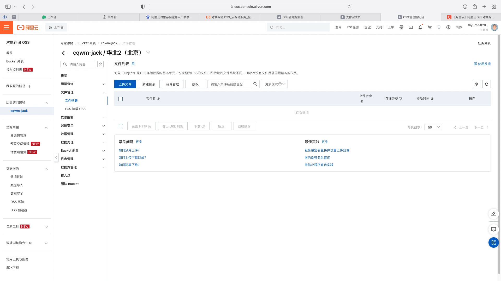


**上传图片**

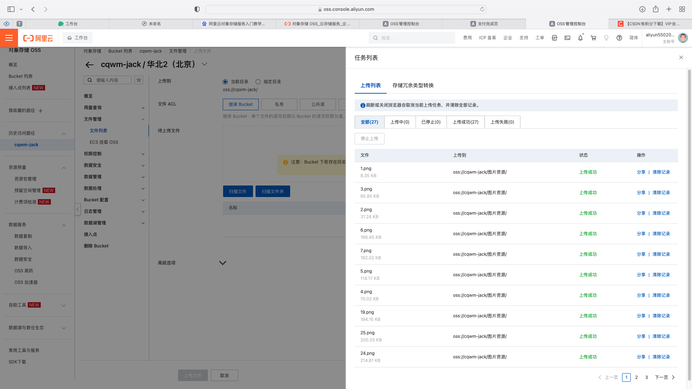

**代码开发**

开发文件上传接口：

```yaml
sky:  
	alioss:
      endpoint: oss-cn-beijing.aliyuncs.com
      access-key-id: LTAI5t7SPJHRFfQnCLEo9qZj
      access-key-secret: DYAbGucFcUgP3Jf1RAgMecTqKed1fc
      bucket-name: cqwm-jack
```

```yaml
sky: 
	  alioss:
    endpoint: ${sky.alioss.endpoint}
    access-key-id: ${sky.alioss.access-key-id}
    access-key-secret: ${sky.alioss.access-key-secret}
    bucket-name: ${sky.alioss.bucket-name}
```

配置属性类：

```java
@Component
@ConfigurationProperties(prefix = "sky.alioss")
@Data
public class AliOssProperties {

    private String endpoint;
    private String accessKeyId;
    private String accessKeySecret;
    private String bucketName;

}
```

**阿里OSS工具类**

```java
@Data
@AllArgsConstructor
@Slf4j
public class AliOssUtil {

    private String endpoint;
    private String accessKeyId;
    private String accessKeySecret;
    private String bucketName;

    /**
     * 文件上传
     *
     * @param bytes
     * @param objectName
     * @return
     */
    public String upload(byte[] bytes, String objectName) {

        // 创建OSSClient实例。
        OSS ossClient = new OSSClientBuilder().build(endpoint, accessKeyId, accessKeySecret);

        try {
            // 创建PutObject请求。
            ossClient.putObject(bucketName, objectName, new ByteArrayInputStream(bytes));
        } catch (OSSException oe) {
            System.out.println("Caught an OSSException, which means your request made it to OSS, "
                    + "but was rejected with an error response for some reason.");
            System.out.println("Error Message:" + oe.getErrorMessage());
            System.out.println("Error Code:" + oe.getErrorCode());
            System.out.println("Request ID:" + oe.getRequestId());
            System.out.println("Host ID:" + oe.getHostId());
        } catch (ClientException ce) {
            System.out.println("Caught an ClientException, which means the client encountered "
                    + "a serious internal problem while trying to communicate with OSS, "
                    + "such as not being able to access the network.");
            System.out.println("Error Message:" + ce.getMessage());
        } finally {
            if (ossClient != null) {
                ossClient.shutdown();
            }
        }

        //文件访问路径规则 https://BucketName.Endpoint/ObjectName
        StringBuilder stringBuilder = new StringBuilder("https://");
        stringBuilder
                .append(bucketName)
                .append(".")
                .append(endpoint)
                .append("/")
                .append(objectName);

        log.info("文件上传到:{}", stringBuilder.toString());

        return stringBuilder.toString();
    }
}
```

## 13. 使用Java操作Redis

Redis的Java客户端很多，常用的几种：

- jedis
- Lettuce
- Spring Data Redis


Spring Data Redis的使用方式：

- 导入Spring Data Redis的maven 坐标
- 配置Redis数据源

```xml
spring:
  redis:
    host: ${sky.redis.host}
    port: ${sky.redis.port}
```

- 编写配置类，创建RedisTemplate对象

```java
@Configuration
@Slf4j
public class RedisConfiguration {

    @Bean
    public RedisTemplate redisTemplate(RedisConnectionFactory redisConnectionFactory){
        RedisTemplate redisTemplate=new RedisTemplate();
        //设置连接工厂对象
        redisTemplate.setConnectionFactory(redisConnectionFactory);
        //设置Redis key的序列化器
        redisTemplate.setKeySerializer(new StringRedisSerializer());
        return  redisTemplate;
    }
}
```

- 通过RedisTemplate对象操作Redis

```java
@SpringBootTest
public class SpringdateRedis {
    @Autowired
    private RedisTemplate redisTemplate;

    @Test
    public void testRedisTemplate(){
        System.out.println(redisTemplate);
        //操作String类型的对象
        ValueOperations valueOperations = redisTemplate.opsForValue();
        //操作hash类型的对象
        HashOperations hashOperations = redisTemplate.opsForHash();
        //操作list类型对象
        ListOperations listOperations = redisTemplate.opsForList();
        //获得Set类型的操作对象
        SetOperations setOperations = redisTemplate.opsForSet();
        //获得Zset类型的操作对象
        ZSetOperations zSetOperations = redisTemplate.opsForZSet();
    }

    @Test
    public void testString() throws InterruptedException {
        //set get setex setnx
        redisTemplate.opsForValue().set("city","北京");
        String city = (String) redisTemplate.opsForValue().get("city");
        System.out.println(city);
        redisTemplate.opsForValue().set("name","上海",5, TimeUnit.SECONDS);
        String name = (String) redisTemplate.opsForValue().get("name");
        System.out.println(name);
        Thread.sleep(Long.parseLong("5000"));
        System.out.println(name);
        redisTemplate.opsForValue().setIfAbsent("lock","1");
        redisTemplate.opsForValue().setIfAbsent("lock","2");
        System.out.println("lock");

    }

    @Test
    public void testHash(){
        //hset hget hdel hkeys hvals
        HashOperations hashOperations = redisTemplate.opsForHash();
        //向redis中插入对象数据，一个key就表示一个对象
        hashOperations.put("100","name","tom");
        hashOperations.put("100","age","15");
        //获得hash数据
        String name = (String) hashOperations.get("100", "name");
        System.out.println(name);
        //获得hash表所有keys
        Set keys = hashOperations.keys("100");
        System.out.println(keys);
        //获得所有value
        List values = hashOperations.values("100");
        System.out.println(values);
        //删除age
        hashOperations.delete("100","age");
    }
  
  @Test
  public void testList(){
    //lpush lrange rpop llen
    ListOperation listOperation = redisTemplate.opsForList();
    
    listOperation.leftPushAll("mylist","a","b","c");
    listOperation.leftPush("mylist","b");
    
    List mylist=listOperation.range("mylist",0,-1);
    System.out.println("mylist");
    
    listOperation.rightPop("mylist");
   
    long size=listOperation.size("mylist");
    System.out.println(size);
  }

}
```

## 14. HttpClient

HttpClient是Apache jakarta Common下的子项目，可以用来提供高效的、最新的、功能丰富的支撑HTTP协议的客户端编程工具包，并且它支持HTTP协议最新的版本和建议

```XML
<dependency>
   <groupId>org.apache.httpcompoents</groupId>
  <artifactId>httpclient</artifactId>
  <version>4.5.13</version>
</dependency>
```

核心API：

- HttpClient
- HttpClients
- CloseableHttpClient
- HttpGet
- HttpPost

发送请求步骤：

- 创建HttpClient对象
- 创建Http请求对象（get还是post）
- 调用HttpClient的execute方法发送请求

入门案例：

```java
@SpringBootTest
public class HttpClientTest {
    /**
     * 测试httpclient发送get方式的请求
     *
     */
     @Test
     public void testGet() throws IOException {
         //创建HTTPclient对象
         CloseableHttpClient httpclient = HttpClients.createDefault();
         //创建请求对象
         HttpGet httpGet = new HttpGet("http://localhost:8080/user/shop/status");
         //发送请求
         CloseableHttpResponse response = httpclient.execute(httpGet);
         //获取状态码
         int statusCode = response.getStatusLine().getStatusCode();
         System.out.println(statusCode);
         //获取响应数据
         HttpEntity entity = response.getEntity();
         //解析响应体
         String s = EntityUtils.toString(entity);
         System.out.println("服务端响应结果："+s);
         //关闭资源
         response.close();
         httpclient.close();
     }

    /**
     * 测试Httpclient发送post方式的请求
     * 
     */
    @Test
    public void testPost() throws IOException {
        //创建HTTPclient对象
        CloseableHttpClient httpclient = HttpClients.createDefault();
        //创建请求对象
        HttpPost httpPost = new HttpPost("http://localhost:8080/admin/employee/login");
        //封装参数
        JSONObject jsonObject=new JSONObject();
        jsonObject.put("username","admin");
        jsonObject.put("password","123456");
        StringEntity entity=new StringEntity(jsonObject.toString());
        httpPost.setEntity(entity);
        //指定请求的编码方式
        entity.setContentEncoding("utf-8");
        entity.setContentType("application/json");
        //发送请求
        CloseableHttpResponse response = httpclient.execute(httpPost);
        //获取状态码
        int statusCode = response.getStatusLine().getStatusCode();
        System.out.println("响应码:"+statusCode);
        //获取响应数据
        HttpEntity entity2 = response.getEntity();
        //解析响应体
        String s = EntityUtils.toString(entity);
        System.out.println("服务端响应结果："+s);
        //关闭资源
        response.close();
        httpclient.close();
    }
}
```

## 15. 微信小程序开发

开发微信小程序之前需要做如下准备工作：

- 注册小程序
- 完善小程序信息
- 下载开发者工具

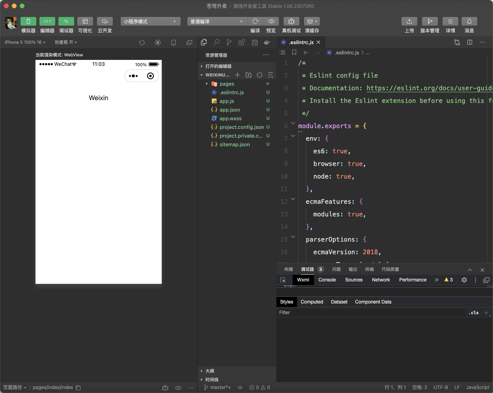

- 入门案例

  - 了解小程序目录结构

    小程序包含一个描述整体程序的app和多个描述各自页面的page，一个小程序主题由三个文件组成，必须放在项目的根目录下：

    | 文件     | 必需 | 作用             |
    | -------- | ---- | ---------------- |
    | app.js   | 是   | 小程序逻辑       |
    | app.json | 是   | 小程序公共配置   |
    | app.wxss | 否   | 小程序公共样式表 |

    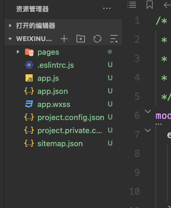

    一个小程序的页面由四个文件组成：

    | 文件类型 | 必需 | 作用       |
    | -------- | ---- | ---------- |
    | js       | 是   | 页面逻辑   |
    | wxml     | 是   | 页面结构   |
    | json     | 否   | 页面配置   |
    | wxss     | 否   | 页面样式表 |

    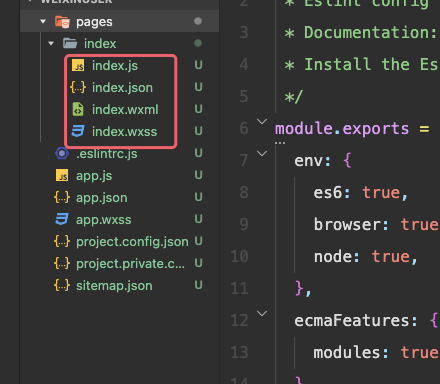

  - 编写小程序代码

  **index.js**

  ```js
  // index.js
  Page({
    data:{
      msg:'hello world',
      nickName:'',
      url:'',
      code:''
    },
    //获取微信用户的头像和昵称
    getUserInfo(e){
       wx.getUserProfile({
         desc: '获取用户信息',
         success: (res) =>{
           console.log(res.userInfo)
           this.setData({
             nickName: res.userInfo.nickName,
             url: res.userInfo.avatarUrl
           })
         }
         })
    },
    //微笑登陆获取用户的授权码
    wxLogin(){
      wx.login({
        success : (res)=>{
          console.log(res.code)
          this.setData({
            code: res.code
          })
        }
      })
    },
    //发送异步请求
    sendRequst(){
      wx.request({
        url: 'http://localhost:8080/user/shop/status',
        method: 'GET',
        success: (res)=>{
          console.log(res.data)
        }
      })
    }
  })
  
  ```

  **index.wxml**

  ```xml
  <!--index.wxml-->
  <scroll-view class="scrollview" scroll-y type="list">
    <view class="container">
      <view>
         {{msg}}
      </view>
      <view>
         <button bindtap="getUserInfo" type="primary">获取用户信息</button>
         昵称：{{nickName}}
  
         <image style="width: 100px;height:100px" src="{{url}}"></image>
      </view>
      <view>
         <button type="warn" bindtap="wxLogin">微信登陆</button>
         授权吗: {{code}}
      </view>
      <view>
        <button type="default" bindtap="sendRequst">发送请求</button>
      </view>
    </view>
  </scroll-view>
  
  ```

  - 编译小程序

  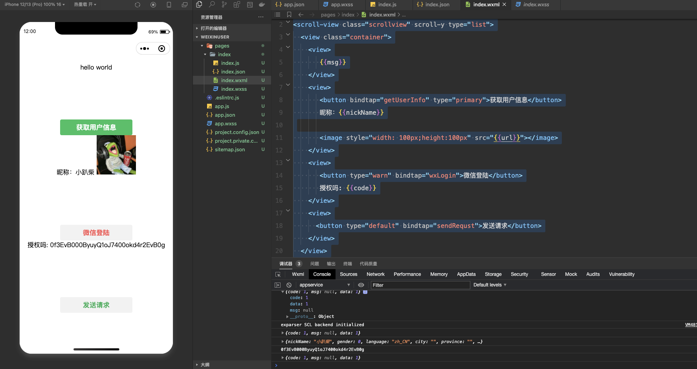

  - 发布小程序：点击上传按钮上传到微信服务器，然后提交审核就行了

## 16. 微信小程序登陆功能

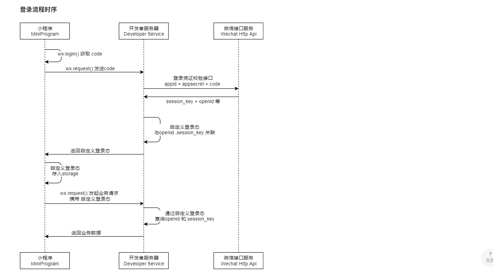

- 配置登陆所需配置项

```yaml
#设置jwt

sky:
  jwt:
    # 设置jwt签名加密时使用的秘钥
    user-secret-key: itcast
    # 设置jwt过期时间
    user-ttl: 7200000
    # 设置前端传递过来的令牌名称
    user-token-name: authentication   
  wechat:
    appid: ${sky.wechat.appid}
    secret: ${sky.wechat.secret}

```

- 控制器

```java
@PostMapping("/login")
    @ApiOperation("微信登陆")
    public Result<UserLoginVO> login(@RequestBody UserLoginDTO userLoginDTO){
        log.info("微信用户登陆:{}",userLoginDTO.getCode());
        //微信登陆
        User user = userService.wechatLogin(userLoginDTO);
        //为微信用户生成jwt令牌
        Map<String,Object> claims=new HashMap<>();
        //唯一标识用户
        claims.put(JwtClaimsConstant.USER_ID,user.getId());
        String token=JwtUtil.createJWT(jwtProperties.getUserSecretKey(),jwtProperties.getUserTtl(),claims);
        UserLoginVO userLoginVo = UserLoginVO.builder()
                .id(user.getId())
                .openid(user.getOpenid())
                .token(token)
                .build();
        return Result.success(userLoginVo);
    }
```

- 服务层

```java
@Service
public class UserServiceImpl implements UserService {
    
    private static final String longinUrl="https://api.weixin.qq.com/sns/jscode2session";
    
    @Autowired
    private WeChatProperties weChatProperties;
    
    @Autowired
    private UserMapper userMapper;
    /**
     * 用户微信登陆
     * @param userLoginDTO
     * @return
     */
    @Override
    public User wechatLogin(UserLoginDTO userLoginDTO) {
        String openid = getOpenId(userLoginDTO.getCode());
        //判断OpenId是否为空，如果为空则登陆失败（即用户的合法信不是我们来判断的，而是微信官方来判断的）
        if (openid==null) {
            throw new LoginFailedException(MessageConstant.LOGIN_FAILED);
        }
        
        //对于外卖系统来说是否是新用户
        User user = userMapper.getByOpenId(openid);
        if (user==null) {
            user=User.builder()
                    .openid(openid)
                    .createTime(LocalDateTime.now())
                    .build();
            userMapper.insert(user);
        }
        //返回用户对象
        return user;
    }

    /**
     * 获取OpenId的私有方法
     * @param code
     * @return
     */
    private String getOpenId(String code){
        //调用微信接口服务，获得微信用户的userId
        Map<String,String> param=new HashMap<>();
        param.put("appid",weChatProperties.getAppid());
        param.put("secret",weChatProperties.getSecret());
        param.put("js_code",code);
        param.put("grant_type","authorization_code");
        String json = HttpClientUtil.doGet(longinUrl, param);
        //判断OpenId是否为空，如果为空则登陆失败（即用户的合法信不是我们来判断的，而是微信官方来判断的）
        JSONObject jsonObject = JSON.parseObject(json);
        String openid = jsonObject.getString("openid");
        return openid;
    }
}
```

## 17. Spring Cache

Spring Cache是一个框架，实现了基于注解的缓存功能，只需要简单地加一个注解，就能实现缓存功能。Spring Cache提供了一层抽象，底层可以切换不同的缓存实现，例如：

- EHCache
- Caffeine
- Redis

常用注解：

| 注解           | 说明                                                         |
| -------------- | ------------------------------------------------------------ |
| @EnableCaching | 开启缓存注解功能，通常加在启动类上                           |
| @Cacheable     | 在方法执行前先查询缓存中是否有数据，如果有数据，则直接返回缓存数据，如果没有缓存数据，调用方法并将方法值放到缓存中 |
| @CachePut      | 将方法的返回值放到缓存中（和前者的区别是，该注解只会放不会查） |
| @CacheEvict    | 将一条或多条数据从缓存中删除                                 |

```java
@CachePut(cacheNames="userCache",key="#user.id") //使用SpringCache缓存数据，key的生成结果为userCache::2）(user是方法中的参数名称)
@CachePut(cacheNames="userCache",key="#result.id") //result关键字代表方法的返回值结果
@CachePut(cacheNames="userCache",key="#p0.id") 
@CachePut(cacheNames="userCache",key="#a0.id") //p0和a0都是代表第一个参数
@CachePut(cacheNames="userCache",key="#root.args[0].id")//获得第一个参数 
public User save(@RequestBody User user){
}
```

```java
@Cacheable(cacheNames ="userCache",key="#id")
public User getById(Long id){
  
}
```

```java
@CacheEvict(cacheNames="userCache",key="#id")
public void deleteById(Long id){
  
}

@CacheEvict(cacheNames="userCache",allEntries=true)
public void deleteAll(){
  
}
```

## 18. 微信支付

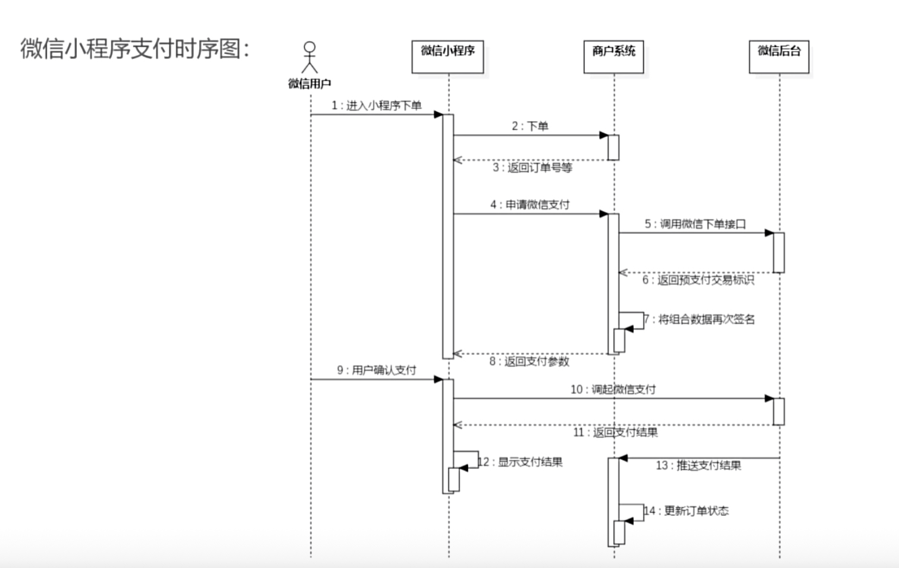

**微信支付的使用**

- 商务系统调用微信后台时如何保证数据安全？

获取微信支付平台证书、商户私钥文件

- 在微信后台推送支付结果时需要访问我们的商户平台，现在我们的系统是不是在局域网IP上，为了让微信平台成功访问到我们的商户平台，这时候需要进行内网穿透（使用Cpolar）

Cpolar[使用教程](https://www.cpolar.com/blog/macos-builds-web-services-and-accesses-them-on-the-public-network)

启动复活获取IP地址

```bash
$ ./cpolar http 8080. #注意我这是mac版，windows命令会有些许不同，然后我的本地tomcat端口是8080
```

然后我们就可以获取临时域名：

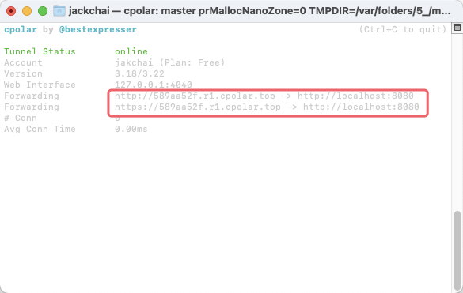

同时也会记录我们的访问记录

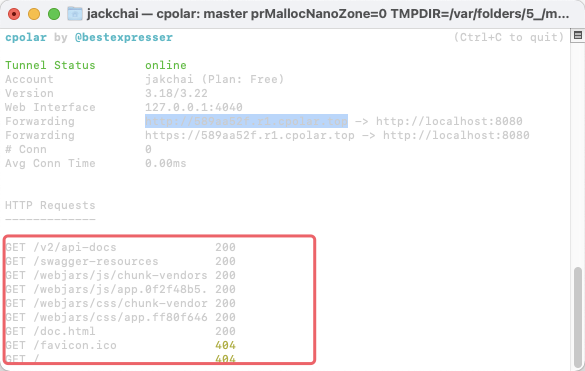

然后外网就可以访问我们的本地项目了

## 19. 校验收货地址是否超出配送范围

- 环境准备

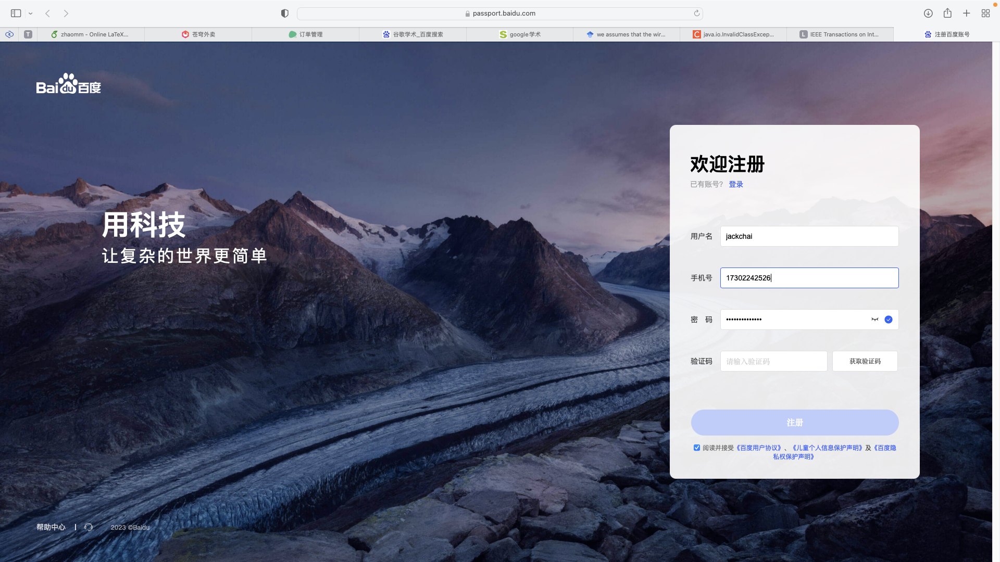

- 登录百度地图开放平台


- 进入控制台，创建应用，获取AK

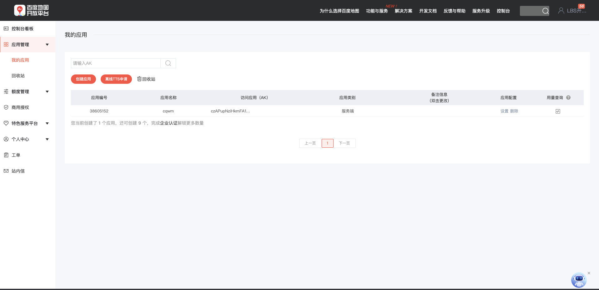

- 在配置文件中配置

```yaml
  shop:
    address: ${sky.shop.address}
  baidu:
    ak: ${sky.baidu.ak}
```

- 改造OrderServiceImpl，注入上面的配置项：

~~~java
    @Value("${sky.shop.address}")
    private String shopAddress;

    @Value("${sky.baidu.ak}")
    private String ak;
~~~

- 在OrderServiceImpl中提供校验方法：

~~~java
/**
     * 检查客户的收货地址是否超出配送范围
     * @param address
     */
    private void checkOutOfRange(String address) {
        Map map = new HashMap();
        map.put("address",shopAddress);
        map.put("output","json");
        map.put("ak",ak);

        //获取店铺的经纬度坐标
        String shopCoordinate = HttpClientUtil.doGet("https://api.map.baidu.com/geocoding/v3", map);

        JSONObject jsonObject = JSON.parseObject(shopCoordinate);
        if(!jsonObject.getString("status").equals("0")){
            throw new OrderBusinessException("店铺地址解析失败");
        }

        //数据解析
        JSONObject location = jsonObject.getJSONObject("result").getJSONObject("location");
        String lat = location.getString("lat");
        String lng = location.getString("lng");
        //店铺经纬度坐标
        String shopLngLat = lat + "," + lng;

        map.put("address",address);
        //获取用户收货地址的经纬度坐标
        String userCoordinate = HttpClientUtil.doGet("https://api.map.baidu.com/geocoding/v3", map);

        jsonObject = JSON.parseObject(userCoordinate);
        if(!jsonObject.getString("status").equals("0")){
            throw new OrderBusinessException("收货地址解析失败");
        }

        //数据解析
        location = jsonObject.getJSONObject("result").getJSONObject("location");
        lat = location.getString("lat");
        lng = location.getString("lng");
        //用户收货地址经纬度坐标
        String userLngLat = lat + "," + lng;

        map.put("origin",shopLngLat);
        map.put("destination",userLngLat);
        map.put("steps_info","0");

        //路线规划
        String json = HttpClientUtil.doGet("https://api.map.baidu.com/directionlite/v1/driving", map);

        jsonObject = JSON.parseObject(json);
        if(!jsonObject.getString("status").equals("0")){
            throw new OrderBusinessException("配送路线规划失败");
        }

        //数据解析
        JSONObject result = jsonObject.getJSONObject("result");
        JSONArray jsonArray = (JSONArray) result.get("routes");
        Integer distance = (Integer) ((JSONObject) jsonArray.get(0)).get("distance");

        if(distance > 5000){
            //配送距离超过5000米
            throw new OrderBusinessException("超出配送范围");
        }
    }
~~~

## 20. Spring Task

- 简介

Spring Task是Spring框架提供的任务调度工具，可以按照约定的时间自动执行某个代码逻辑。（定时任务框架，定时来自动执行某段java代码）

- 常用应用场景

1. 信用卡每月还款提醒
2. 银行贷款每月还款提醒
3. 火车票售票系统处理未支付的订单

4. 入职记念日为用户发送通知

- cron表达式

cron表达式本质上就是一个字符串，通过cron表达式可以定义任务触发的时间

cron表达式的构成规则：分为6-7个域，由空格分隔开，每个域代表一个含义

> 秒、分钟、小时、日、月、周、年（可选）
>
> 例如：描述2022年10月12日上午9点整对应的cron表达式为：
>
> 0 0 9 12 10 ？ 2022

[cron表达式在线生成器](https://cron.qqe2.com)

- 入门案例

1. 导入maven坐标spring-context（已存在）
2. 启动类添加注解`@EnableScheduling`开启任务调度

```java
@EnableScheduling 
public class SkyApplication{
  public static void main(String[] args){
    SpringApplication.run(SkyApplication.class,args);
    log.info("server started");
  }
}
```

3. 自定义定时任务类

```java
@Component
public class Mytask{
  //定时任务，每5s执行一次
  @Scheduled(cron="0/5 * * * *")
  public void executeTask(){
    log.info("定时任务执行:{}",new Date());
  }
}
```

## 21. WebSocket

- 介绍

WebSocket是基于TCP的一种新的网络协议，它实现了浏览器与服务器的全双工通信—浏览器和服务器只需要完成一次握手，两者之间就可以创建持久性的连接，并进行双向数据传输（客户端和服务端首先进行握手操作，然后服务器给客户端一个应答消息，然后双发就可以进行双向通信了）

- HTTP协议和WebSocket协议对比

> - HTTP协议是短连接
> - WebSocket是长连接
> - HTTP通信是单向的，基于请求响应模式
> - WebSocket模式支持双向通信
> - HTTP和WebSocket底层都是TCP连接、

- 应用场景

> - 视频弹幕
> - 网页聊天
> - 体育实况更新
> - 股票基金报价实时更新

## 22. Apache Echarts

- 介绍

Apache Echarts是一款基于javascript的数据可视化图表库，提供直观，生动，可交互，可个性化定制的数据可视化图表。 


## 23.Apache POI

Apache POI是一个处理Miscrosoft office各种文件格式的开源项目。简单来说，我们可以使用POI在java程序中对Miscrosoft Office各种文件进行读写操作。一般情况下，POI都是用于操作Excel文件。

- 应用场景

> 1. 银行网银系统可以导出交易明细
> 2. 各种业务系统导出excel表
> 3. 批量导入业务数据


- 使用案例

```java
public static void write() throws Exception{
        //在内存中创建一个Excel文件
        XSSFWorkbook excel = new XSSFWorkbook();
        //在Excel文件中创建一个Sheet页
        XSSFSheet sheet = excel.createSheet("info");
        //在Sheet中创建行对象,rownum编号从0开始
        XSSFRow row = sheet.createRow(1);
        //创建单元格并且写入文件内容
        row.createCell(1).setCellValue("姓名");
        row.createCell(2).setCellValue("城市");

        //创建一个新行
        row = sheet.createRow(2);
        row.createCell(1).setCellValue("张三");
        row.createCell(2).setCellValue("北京");

        row = sheet.createRow(3);
        row.createCell(1).setCellValue("李四");
        row.createCell(2).setCellValue("南京");

        //通过输出流将内存中的Excel文件写入到磁盘
        FileOutputStream out = new FileOutputStream(new File("D:\\info.xlsx"));
        excel.write(out);

        //关闭资源
        out.close();
        excel.close();
    }


    /**
     * 通过POI读取Excel文件中的内容
     * @throws Exception
     */
    public static void read() throws Exception{
        InputStream in = new FileInputStream(new File("D:\\info.xlsx"));

        //读取磁盘上已经存在的Excel文件
        XSSFWorkbook excel = new XSSFWorkbook(in);
        //读取Excel文件中的第一个Sheet页
        XSSFSheet sheet = excel.getSheetAt(0);

        //获取Sheet中最后一行的行号
        int lastRowNum = sheet.getLastRowNum();

        for (int i = 1; i <= lastRowNum ; i++) {
            //获得某一行
            XSSFRow row = sheet.getRow(i);
            //获得单元格对象
            String cellValue1 = row.getCell(1).getStringCellValue();
            String cellValue2 = row.getCell(2).getStringCellValue();
            System.out.println(cellValue1 + " " + cellValue2);
        }

        //关闭资源
        in.close();
        excel.close();
    }

    public static void main(String[] args) throws Exception {
        //write();
        read();
    }
```

